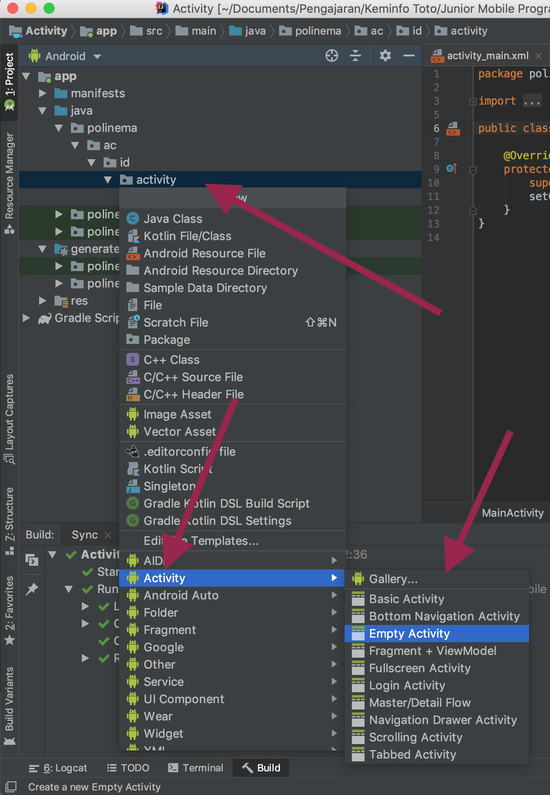
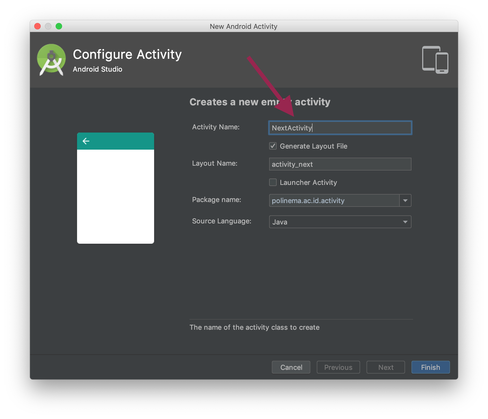
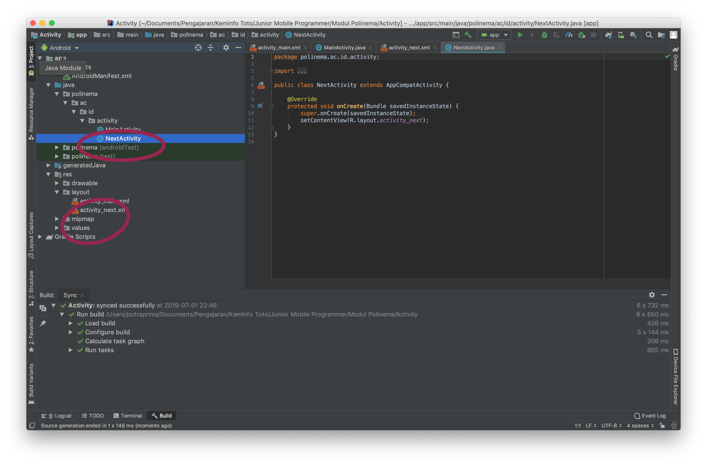
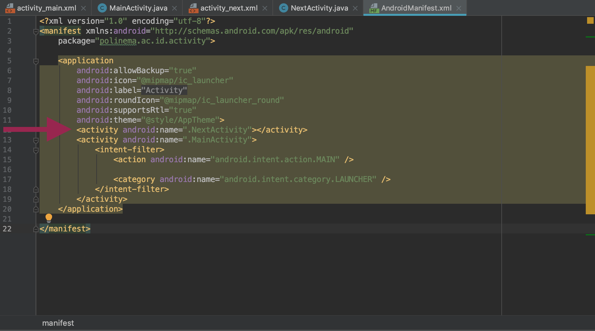
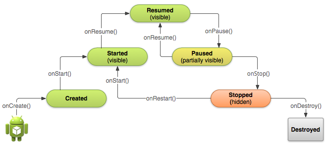
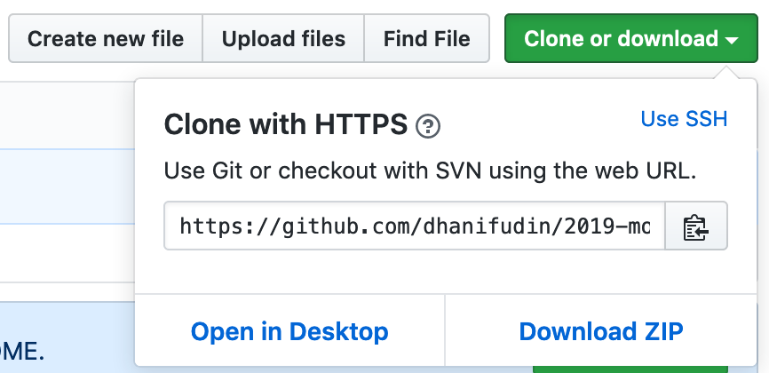
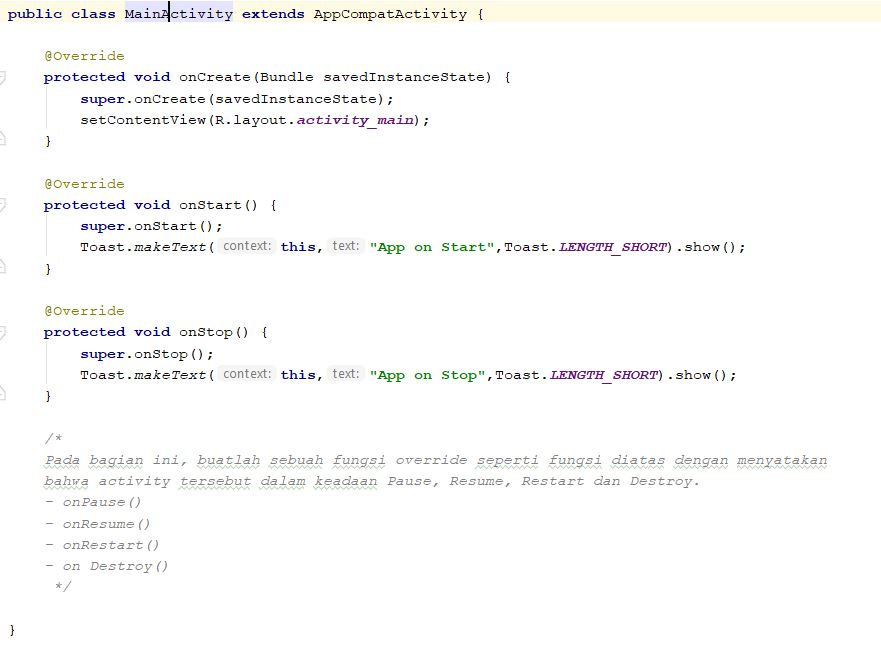

# Activity

## Pengertian Activity

Activity adalah:

- Komponen yang menampilkan dan mengatur halaman aplikasi sebagai tempat
  interaksi antara pengguna dengan aplikasi Android.
- Class MainActivity secara otomatis akan ter-generate ketika membuat suatu
  project. Class tersebut merupakan extends dari Class Activity.
- Terdapat dua method yang pasti dimiliki oleh satu activity, yaitu:

1. **onCreate()**. Untuk menginisiasi/membuat suatu activity
2. **onPause()**. Untuk menyatakan ketika user meninggalkan suau activity.

- Untuk menghubungkan Activity dengan tampilan yang telah dibentuk pada xml,
  digunakan fungsi **setContentView()**.
- Untuk memanggil widget pada activity digunakan fungsi **findViewById()**.

## Cara Membuat Activity

Untuk membuat activity dapat dilakukan secara manual atau menggunakan template
yang disediakan oleh android studio. Berikut ini langkah langkah untuk membuat
sebuah activity.

1. Klik kanan pada package yang ada pada new project kemudian pada menu yang ada
   pilih menu `activity` kemudian pada pilihan template pilihlah `empty activity`



2. Kemudian pada dialog yang muncul isikan nama activity yang akan anda buat,
   pada screenshot ini dibuat sebuah activity dengan nama `Next Activity`



3. Klik finish, ketika anda meng klik tombol finish Android Studio melakukan
   finalisasi pembuatan activity dengan melengkapi activity tersebut dengan
   sebuah file template xml dan mendaftarkannya ke Android Manifest.



4. Hasil android manifest yang sudah berubah dapat dilihat pada gambar dibawah ini



5. Jika anda ingin membuat sebuah activity tanpa mengikuti template yang
   disediakan android studio dapat dilakukan dengan melakukan langkah langkah di
   atas secara manual, mulai dari membuat sebuah class yang mengextend class
   `AppCompatActivity` kemudian membuat sebuah layout xml dan memanggilnya pada
   fungsi `onCreate()` di activity yang dibuat dan langkah terakhir adalah
   mendaftarkan activity tersebut ke Android Manifest.

## Activity Life Cycle (Daur Hidup Activity)

- Activity aplikasi android dikelola dengan sistem “activity stack” (antrian
  bertumpuk).
- Ketika suatu activity dinyatakan “start” maka activity tersebut terletak di
  atas dari activity-activity yang telah berjalan pada “activity stack”. Keadaan
  tersebut bertahan hingga muncul suatu activity baru.
- Empat keadaan yang dimiliki activity, yaitu:

1. **Active/running**: Jika activity tersebut berada pada posisi atas
   “stack activity”.
2. **Paused**: Jika activity tersebut tidak dipakai atau akan dibutuhkan
   pada suatu saat tertentu namun, activity itu masih ada atau visible.
   Activity yang berada pada keadaan “pause” masih tersimpan pada memory.
   Namun jika memori telah penuh bias saja activity tersebut terhapus.
3. **Stopped**: Jika activity sudah tidak dipakai dan digantikan oleh
   activity lain. Activity yang telah “stopped” tidak akan dipanggil lagi,
   dan memori akan menghapus segala informasi mengenai activity tersebut.
4. **Restart**: Jika activity “paused” atau “stopped”, sistem dapat
   menghapus activity ini dari memory, dan ketika activity ini dibutuhkan
   dan dipanggil kembali maka, activity akan kembali ke keadaan awal
   (restart).



## Praktikum

1. Bukalah tautan [Starter Code](https://github.com/polinema-mobile/2019-mobile02) berikut.

2. Perhatikan pada pojok kanan atas halaman GitHub, terdapat tombol
   . Lakukan proses fork repository dengan menekan
   tombol Fork, tunggu hingga proses selesai.

   > **Catatan**: Fork adalah proses untuk menyalin repository dari repository
   > kepemilikan seseorang ke repository sendiri. Fork biasanya digunakan untuk
   > berkontribusi ke repository orang lain atau menjadikannya sebagai starter
   > code.

3. Jika proses fork telah selesai, maka anda akan mempunyai salinan repository
   pada akun GitHub anda.


4. Lakukan proses clone dengan menyalin url repository fork. Pastikan url
   menggunakan username akun GitHub anda.



5. Buka aplikasi terminal atau cmd, jalankan perintah clone dengan git. Contoh:

```
git clone https://github.com/<username>/2019-mobile02

```

> **Catatan**: Ubah `<username>` dengan akun GitHub anda.

6. Dalam starter code terdapat dua project Android, bukalah project
   **AndroidLifecycle** dengan menggunakan menu **Open** dari Android Studio.
   Tunggu hingga proses build selesai.

7. Pada project Android secara otomatis akan dibuatkan Activity utama dengan
   nama `MainActivity` yang didefinisikan dalam `MainActivity.java` serta
   `activity_main.xml` untuk pengaturan layoutnya. Selain itu, pada Activity
   dibuatkan juga default callback `onCreate()`.

8. Untuk memahami lebih lanjut mengenai lifecycle pada Android, tambahkan dua
   callback `onStart()` dan juga `onStop()` dengan _override_. Sehingga hasil
   akhir menjadi seperti pada gambar berikut.



> **Tips**: Untuk melakukan _override_ anda dapat menggunakan shortcut `Ctrl + o`
> kemudian pilih nama method yang akan di-_override_. Atau anda dapat
> langsung mengetikkan nama method yang akan di-_override_ kemudian dilanjutkan
> dengan `Ctrl + space` dan `Enter`. Contoh: `onSt Ctrl + space` akan muncul suggestion
> `onStart()`

> **Catatan**: `Toast` digunakan untuk menampilkan pesan pop up pada Android.
> `Toast.LENGTH_SHORT` mengatur berapa lama pesan pop up akan ditampilkan.
> Secara umum struktur code Toast sebagai berikut.
>
> ```java
> Toast.makeText(this, "This is a message", Toast.LENGTH_SHORT).show();
> ```

9. Jalankan kode tersebut.

10. Perhatikan tampilan _pop up_ yang keluar ketika aplikasi dijalankan.

11. Lengkapi kode seperti gambar berikut kemudian jalankan kembali.

```java
public class MainActivity extends AppCompatActivity {

	@Override
	protected void onCreate(Bundle savedInstanceState) {
		super.onCreate(savedInstanceState);
		setContentView(R.layout.activity_main);
	}

	@Override
	protected void onStart() {
		super.onStart();
		Toast.makeText(this, "Application On Start", Toast.LENGTH_SHORT).show();
	}

	@Override
	protected void onStop() {
		super.onStop();
		Toast.makeText(this, "Application On Stop", Toast.LENGTH_SHORT).show();
	}

	@Override
	protected void onRestart() {
		super.onRestart();
		Toast.makeText(this, "Application On Restart", Toast.LENGTH_SHORT).show();
	}

	@Override
	protected void onResume() {
		super.onResume();
		Toast.makeText(this, "Application On Resume", Toast.LENGTH_SHORT).show();
	}

	@Override
	protected void onPause() {
		super.onPause();
		Toast.makeText(this, "Application On Pause", Toast.LENGTH_SHORT).show();
	}

	@Override
	protected void onDestroy() {
		super.onDestroy();
		Toast.makeText(this, "Application On Destroy", Toast.LENGTH_SHORT).show();
	}
}
```

12. Tambahkan semua perubahan ke dalam repository dengan git. Kemudian commit
    dan push ke repository GitHub anda.
